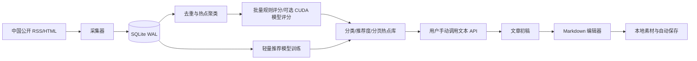

# Content Idea Workflow

一个面向中国读者、个人单机使用的营销号选题与图文创作工作台。

它会从真实的中国公开数据源采集热点，把重复报道聚成一个选题，按时效、来源覆盖、传播速度、内容质量、冲突性、风险和用户反馈计算推荐度；你明确点击后，才会调用自己配置的文本/图片 API。文章生成后可以在 Markdown 编辑器中排版、预览、插图和保存，适合“发现热点 → 判断能不能写 → 生成初稿 → 编辑 → 待发布”的个人工作流。

本项目不内置演示数据、不伪造热点、不内置大语言模型，也不包含模拟 API。数据库中的数据必须来自你启用的真实数据源或你主动填写的内容；AI 只使用你在“设置”中提供的 API。

## 产品边界

- 运行环境：Windows、本地单机、Python 3.11+、SQLite。
- 前端：服务端渲染的 HTML/CSS/原生 JavaScript，不使用 React/Vue，也不需要 Node.js。
- AI：不在本机加载 LLM；文本、图片、选题分析和图片位置规划均调用用户自己的 API。
- 推荐模型：只训练轻量的本地排序模型；训练页可选择自动、CPU 或 CUDA，GPU 不是运行平台的硬依赖。
- 数据源：全新安装默认提供中国媒体和中国科技社区来源；用户手动添加的合法公开来源不受地域限制，启动时不会被删除或修改。
- 发布：平台只管理草稿和状态，不自动发布到公众号、头条或其他外部平台。

## 已实现功能

### 热点采集与选题库

- RSS/Atom 单轮采集；可选静态 HTML 和 Playwright 动态页面。
- 每次手动运行只执行一轮，用户可以勾选本轮启用的数据源。
- 持久化 `CrawlRun` 与逐源 `CrawlLog`，页面显示进度、成功数、失败数和错误原因，并提供清空日志按钮。
- 每个源都有 5–300 秒单源超时；每轮还有 30–3600 秒总超时。超时后不再启动新的源，已采集数据不会回滚。
- 采集中可以请求暂停；当前源完成后进入“已暂停”，点击继续会从未完成的源恢复，不会重复已完成源。
- 如果本地进程意外退出，重启时会把未完成轮次自动转为可继续的“已暂停”，不会把中断误记为成功。
- URL 去重、标题相似度聚类、来源数与近 6 小时速度统计。
- 热点按 `IT 科技、财经商业、社会民生、政策时政、国际、健康、文体娱乐、其他` 分类。
- 热点库按数据库分页，每页 30 条；搜索和分类筛选会保留分页条件，不再把上千条记录一次性加载到浏览器。
- 推荐列表默认只显示“待处理”热点：已经点开、收藏、不感兴趣、生成过文章、编辑过文章或已有文章的热点不会反复占用推荐位；“全部”和“已处理”入口仍可找回历史热点。
- 排序指标包含新鲜度、来源覆盖、传播速度、内容质量、冲突度、风险度、模型分和用户行为反馈。
- 采集评分按整轮批量执行：空采集不会触发全表评分，多数据源产生的热点只会在本轮结束时刷新一次；规则统计使用批量 SQL，已训练的 CUDA 版 XGBoost 模型会批量尝试 GPU 预测并在异常时回退 CPU。

### 中国真实数据源

全新数据库首次启动时会补充以下真实公开 RSS。默认目录不含外国来源，但这只是默认值，不是地域白名单：

- 中国新闻网：滚动、国内、社会、财经
- IT之家
- 少数派
- 爱范儿
- 博客园站点首页
- 极客公园
- 量子位
- 钛媒体
- InfoQ 中国
- 开源中国
- V2EX
- SegmentFault
- 雷锋网
- 人人都是产品经理

在“数据源”页面可以停用/启用单个来源、设置单源超时，也可以点击“补充中国精选源”恢复缺失的精选源。你手动添加的来源会原样保留；应用启动、升级和定时采集都不会自动删除、停用或改写它们。自定义地址仍必须通过公网 URL 安全校验。

关键词搜图默认使用 360 图片中国搜索。搜图失败会明确显示错误，不会静默切换外国图片引擎。搜索结果只作为素材候选，发布前必须核对原始页面、版权和平台规则；已有历史文章中的旧素材会保留，以免破坏文章正文。

### AI 选题与文章

- AI 选题分析必须在热点详情页手动点击，不会随着采集自动消耗 Token。
- 选题推荐固定返回 5 个结构化角度：标题、切入方式、读者价值；生成文章前必须选择一个角度或填写自定义角度。
- 文章类型、写作风格、目标篇幅可配置；篇幅范围为 300–10000 字。
- 生成初稿支持：不配图、中国搜索配图、调用用户图片 API 生成配图。
- 配图数量可以自动按篇幅决定 1–4 张，也可以手工指定 1–6 张。
- 自动搜图会把文章标题、对应小标题、该章节首段上下文和用户补充说明组合成检索词；中国图片搜索返回结果后还会按主题词做相关性筛选，无关结果不会保存到素材库。
- 图片插入方式可以选择：
  - 模型按章节智能插入：额外调用一次文本模型，让模型只返回图片编号、章节标题和原文短语，真正的 Markdown 插入由本地代码完成。
  - 按篇幅均匀插入：不额外调用文本模型，适合 Token 紧张时使用。
  - 只保存到素材库：不改正文，稍后手动插入。
- 智能排版模型不可用或返回格式错误时，自动回退均匀排版，不让整篇文章生成失败。

### 图文 Markdown 编辑器

- H1/H2/H3、粗体、斜体、删除线、引用、列表、链接、行内代码、表格、提示块、分隔线、撤销和重做。
- 左右分栏、只编辑、只预览三种视图。
- Markdown 正文实时安全渲染，关闭原始 HTML，不执行危险链接。
- 显示字数、段落数、标题数和图片数。
- 图片素材卡提供“插入到当前光标”“选择章节/开头/第一段后/中部/结尾”“复制 Markdown”以及服务器位置插入回退操作。
- 编辑器会记住用户最后一次正文光标；点击工具栏或素材按钮不会丢失插入位置。
- 本地浏览器草稿 + 服务端自动保存双重保护：编辑后空闲约 5 秒尝试保存，之后每 30 秒检查一次；失败时仍保留本地草稿，并显示明确状态。
- Markdown 小抄使用浏览器原生折叠面板，提供标题、强调、列表、引用、链接、代码、分隔线和图片等常用写法；即使 JavaScript 暂时不可用也可以打开查看。

### 文章库与轻量推荐模型

- 文章保存后进入“文章库”，按草稿、待发布、已发布分类；搜索按标题、正文和来源热点检索。
- 文章库提供明确的“删除文章”操作和浏览器二次确认；删除会清理文章记录及其本地配图文件，但会保留来源热点，且删除后不可恢复。
- 训练前在“推荐模型”页面看到样本量、正负反馈、标签覆盖、验证集误差、MAE/RMSE、R²、排序相关性、分数分布和特征重要性。
- 有足够反馈样本时使用 XGBoost `hist`；训练时可明确选择自动、CPU 或 CUDA。CUDA 选项只在检测到 NVIDIA GPU 且 XGBoost 启用 CUDA 时开放，自动模式会在 CUDA 不可用时使用 CPU。
- 模型训练改为后台任务：页面实时显示排队、整理数据、训练、验证、应用模型分和刷新排序等阶段，并展示进度百分比、实际设备、样本数、算法、验证指标和错误原因；刷新页面不会丢失训练状态。
- 训练模型只使用本地结构化数据，不会把文章内容或 API Key 上传到第三方。

## 技术架构



代码按职责拆分：

```text
app/
├─ main.py                 FastAPI 应用、路由注册、启动/停止调度器
├─ db.py                   SQLite、WAL、兼容性迁移、首次默认源初始化
├─ models.py               Source/RawItem/Topic/Article/CrawlRun 等模型
├─ source_catalog.py       中国默认 RSS 目录与非破坏性初始化
├─ crawler.py              RSS、HTML、Playwright 采集适配器
├─ topic_pipeline.py       去重、聚类、评分、单批候选缓存
├─ article_format.py       Markdown 渲染、图片查询、图片位置规划插入
├─ ai_provider.py          OpenAI-compatible 文本/图片 API 客户端
├─ image_search.py         360 图片中国搜索与安全下载
├─ recommender.py           反馈、CPU/CUDA 训练、批量模型评分、进度回调和模型指标
├─ routes/                 dashboard/sources/settings/topics/articles/admin
├─ templates/              Jinja2 页面
└─ static/                 原生 JS/CSS
```

## 安装

要求 Python 3.11 或更高版本。

```powershell
git clone https://github.com/fjy566/Content-idea-workflow.git
Set-Location Content-idea-workflow

python -m venv .venv
.\.venv\Scripts\Activate.ps1
python -m pip install --upgrade pip
python -m pip install -e ".[dev]"
```

### 推荐模型训练

平台不会加载 LLM。推荐模型默认可以使用 CPU 训练；如需 CUDA 训练，再安装可选依赖：

```powershell
python -m pip install -e ".[gpu]"
```

同一套 CUDA 版 XGBoost 同时用于训练和采集后的模型评分；不安装或检测不到 CUDA 时，规则评分和模型评分都会自动使用 CPU，不影响采集功能。

打开“推荐模型”页面后，可以选择：

- 自动选择：优先使用可用的 CUDA，否则使用 CPU。
- CPU：使用 scikit-learn 训练，兼容性最好。
- CUDA：使用启用 CUDA 的 XGBoost 训练；如果显卡、驱动或 XGBoost CUDA 支持不完整，选项会被禁用并显示具体原因。

训练不会因为页面刷新而丢失状态。训练任务完成后，页面会展示实际算法、训练设备、模型批量评分设备、训练/验证样本、MAE、RMSE、R²、基线 MAE、目标范围、特征重要性、评分数量和耗时。采集后的规则评分始终使用批量 CPU 计算；如果已有 CUDA 版 XGBoost 模型，模型分会自动批量使用 CUDA，异常时自动回退 CPU。

### 动态网页采集（可选）

优先使用 RSS。只有公开页面确实没有 RSS 时才安装 Playwright：

```powershell
python -m pip install -e ".[browser]"
python -m playwright install chromium
```

## 配置与启动

复制环境变量模板：

```powershell
Copy-Item .env.example .env
```

也可以不改 `.env`，启动后打开“设置”页面填写。密钥只保存在本地 SQLite/环境变量中，不要提交到 Git。

```powershell
python -m app.main
# 或
.\run.ps1
```

打开 <http://127.0.0.1:8000/>。

### 文本 API

填写供应商的 OpenAI-compatible 地址、API Key，并点击“拉取可用模型”。地址可以填写供应商根地址、`/v1` 地址或完整的 `/chat/completions` 地址，平台会按路径补齐请求端点。例如 DeepSeek 可以填写：

```text
Endpoint: https://api.deepseek.com
Model: 点击“拉取可用模型”后选择，或手动填写供应商实际模型名
```

如果第三方服务只兼容 `/v1`，填写：

```text
https://api.example.com/v1
```

模型列表拉取失败时仍可手动填写模型名。平台不会把 API Key 输出到日志、页面或 README。

### 图片 API

图片 API 需要返回下列任一结构：

```json
{"data":[{"b64_json":"..."}]}
```

或：

```json
{"data":[{"url":"https://..."}]}
```

图片 URL 会经过公开地址校验、响应类型校验和大小限制后才保存到本地 `data/images/`。

## 推荐使用顺序

1. 打开“数据源”，确认中国精选 RSS 已启用；不需要的源先停用。
2. 打开“任务”，勾选本轮要采集的源，设置本轮总超时后点击运行。页面会显示逐源进度；需要停止时点击“暂停”，完成当前源后可以点击“继续”。采集不会自动调用 AI。
3. 回到“热点”，默认查看“待处理”列表，用分类、搜索和分页快速筛选；点进标题查看来源和推荐指标。打开详情后，该热点会自动进入“已处理”，下次优先推荐别的热点；需要回看时切换到“全部”或“已处理”。
4. 只有在你明确需要时，点击“AI 分析选题”，等待结构化的 5 个推荐角度返回。
5. 选择一个推荐角度或填写自定义角度，设置文章类型、风格、篇幅和配图策略，点击生成初稿。
6. 生成完成后进入文章编辑器。先把光标放在正文目标位置，再点击素材卡的“插入到当前光标”；也可以选择具体章节。
7. 编辑过程中观察右下方自动保存状态；需要改变工作流时，把文章状态改为草稿、待发布或已发布，然后手动点击“保存文章”。
8. 打开“文章库”确认文章归档位置；文章不会因为离开热点详情页而消失。
9. 积累真实收藏、忽略、生成、编辑和发布反馈后，打开“推荐模型”，选择自动、CPU 或 CUDA，点击训练并观察实时进度和评估数据。

## 数据库、日志和本地文件

默认目录结构：

```text
data/app.db             SQLite 数据库
data/images/            下载/生成的本地图片
data/models/            推荐模型工件
logs/                   可选运行日志
```

SQLite 开启 WAL 和外键约束。启动时会执行小型兼容迁移：补充新列、回填热点分类，并仅在真正的全新数据库中加入中国默认数据源。启动流程不会删除或修改任何已有数据源及其采集内容。采集控制相关的默认值也可以用 `.env` 中的 `SOURCE_TIMEOUT_SECONDS` 和 `CRAWL_ROUND_TIMEOUT_SECONDS` 调整；页面中保存的具体值优先于环境变量。

`.gitignore` 已忽略 `.env`、SQLite 数据库、本地图片、模型和日志。提交前仍应检查 `git status`，确认没有密钥。

## 安全与合规

- 只采集你有权访问的公开 RSS/API/页面，不绕过登录、验证码或反爬措施。
- 尊重来源的服务条款、robots 约定和访问频率；建议使用 30 分钟以上间隔。
- 外部 RSS、文章摘要、图片元数据都按不可信输入处理，不会被当成系统指令执行。
- 搜索图片不等于取得转载授权；发布前逐张核对原始页面、许可和平台要求。
- 默认拒绝本机、内网、元数据地址等明显 SSRF 目标；不要把 API Key 放进文章、截图或 Git。
- 外部 HTTP 请求不会自动跟随未经校验的重定向；POST API 遇到重定向会直接失败，GET 只会在每一跳重新校验公网地址。
- `/media/images/` 只暴露下载或生成的图片，不会把 `data/app.db`、`data/models/` 等内部文件挂到静态目录。
- 图片保存前同时校验响应声明的 MIME 类型和文件签名；文章、自动保存和图片任务遇到空输入会返回明确失败状态，不写入伪成功记录。
- 如运行环境需要 DNS 层面的 SSRF/重绑定防护，可在 `.env` 中设置 `STRICT_SSRF_DNS=1`；启用前请确认本机 DNS 能正确解析公网域名。

## 本版本代码审查结论

本次审查补充了 HTTP 可见的业务流程回归测试，并修复了媒体目录暴露、重定向 SSRF、图片格式伪装、空文章入库、空自动保存、重复图片搜索词、固定位置多图倒序和共享图片误删等问题。测试使用临时 SQLite 和临时媒体目录，不会触碰本地运行中的 `data/` 数据。

## 测试与检查

```powershell
python -m pytest
python -m compileall -q app tests
node --check app/static/article-editor.js
git diff --check
```

当前共收集 89 个测试用例，覆盖采集与调度选择、来源安全校验、默认来源非破坏性初始化、分类、CPU/CUDA 设备选择、推荐模型进度回调、AI 模型发现、文章生成、上下文图片查询与无关结果过滤、Markdown 渲染、Markdown 小抄、图片位置规划、文章库删除与自动保存、模型训练任务状态、文章库/数据源/设置/热点/管理员页面的 POST/Redirect 流程，以及静态媒体隔离、图片签名和路径安全响应头。

## 许可

当前仓库未额外声明开源许可证。使用第三方数据源、图片和 API 时，以各自的服务条款、版权声明和授权范围为准。
